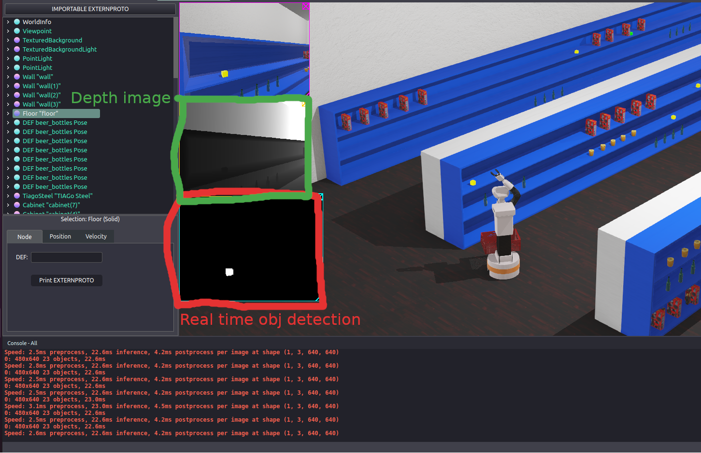

# Project Check-in

## Summary
A lot of work has been done in terms of computer vision and object detection. The robot is capable of real time object detected and 3d object segmentation which we can use to determine required positions for inverse kinematics

### [D1] Mapping
- **Lead:** Patrick Nguyen
- **Target Completion:** April 15
- **Progress**: Incomplete

### [D2] Localization
- **Lead:** Patrick Nguyen
- **Target Completion:** April 15
- **Progress**: Incomplete

### [D3] Path Planning
- **Lead:** Nikko Gajowniczek
- **Target Completion:** April 21
- **Progress**: Incomplete

### [D4] Object Detection (Vision)
- **Lead:** Wei Jiang
- **Target Completion:** April 21
- **Progess**: Completed

### [D5] Manipulation
- **Lead:** Nikko Gajowniczek
- **Target Completion:** April 21
- **Progress**: Gripper opens and closes

### [D6] System Integration & Teleoperation
- **Lead:** Wei Jiang
- **Target Completion:** April 30
- **Progress**: Teleop possible for moving robot and camera (head). Not implemented for the gripper yet. State machine not yet implemented as right now it doesn't do much except detect objects.
